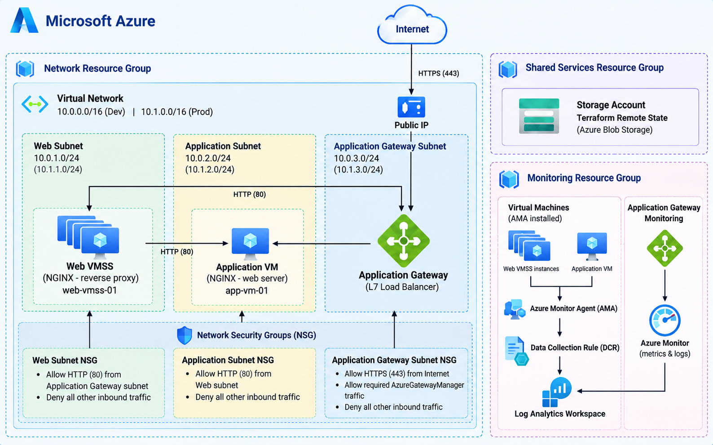

**1. Project Overview**

  The project focuses on building a small-scale enterprise web application platform on Microsoft Azure, with an emphasis on security, scalability, maintainability, and Infrastructure as Code.
  The infrastructure is built with Terraform using reusable modules for networking, compute, Application Gateway, monitoring, and resource groups. The platform is separated into Web and Application tiers, with Azure Application Gateway serving as the single public entry point.
  The project supports separate Dev and Prod environments and uses a dedicated Terraform bootstrap configuration to establish the remote state infrastructure. GitHub Actions is integrated to automate Terraform validation and planning, while GitHub OIDC is used for secure authentication to Azure.

**2. Architecture**

  The platform follows a layered architecture where external traffic enters through a single public Application Gateway and is then routed to private backend components.
  The Application Gateway terminates incoming HTTPS traffic on port 443 and forwards requests to the Web tier over HTTP/80. The Web tier runs on an Azure Virtual Machine Scale Set, with NGINX configured as a reverse proxy. Requests are then forwarded to the private Application VM.
  The Application VM does not have a public IP address and can only receive traffic from the Web tier. The infrastructure uses dedicated subnets for the Application Gateway, Web tier, and Application tier.
  This design provides a clear separation between the public entry point and the backend application components while allowing the Web tier to scale independently.

**3. Infrastructure**
   
  The Azure infrastructure consists of an Application Gateway, Virtual Machine Scale Set, private Application VM, Virtual Network, dedicated subnets, and Network Security Groups.
  The Web tier uses a Virtual Machine Scale Set to support multiple instances behind the Application Gateway. The number of instances and scaling limits are configurable per environment.
  The Application tier currently uses a single private Ubuntu VM because it is expected to handle a lower level of traffic. The Terraform configuration and variables are structured so that additional application instances can be introduced without redesigning the infrastructure.
  Network Security Groups control communication between the different layers. Internet traffic is allowed to the Application Gateway over HTTPS/443, while the Web and Application subnets only allow the internal traffic required for communication between the application tiers.
  All compute resources use Ubuntu Linux. The machines are automatically configured during deployment using cloud-init. NGINX is used as a reverse proxy on the Web tier and as the application-facing web server on the Application VM.

**4. Terraform**
   
  Terraform is used as the main Infrastructure as Code solution. The configuration is organized into reusable modules for resource groups, networking, compute, Application Gateway, and monitoring.
  A separate bootstrap configuration creates the resources required for Terraform remote state management. This includes a dedicated Shared Services resource group, Azure Storage Account, and private Blob Storage container.
  The main infrastructure uses the Storage Account as its remote Terraform backend. Dev and Prod use separate state keys:
  dev.terraform.tfstate
  prod.terraform.tfstate
  The same Terraform codebase is reused for both environments, while environment-specific values are provided through separate .tfvars files.

**5. Monitoring**
   
  Monitoring is implemented using Azure Monitor components to provide visibility into the compute resources and application delivery layer.
  Azure Monitor Agent is deployed to the Application VM and Virtual Machine Scale Set instances, while Data Collection Rules define the telemetry and operating system logs collected from the machines. The collected data is stored in Log Analytics Workspaces.
  Application Gateway monitoring is handled through Azure Monitor metrics and logs, providing additional visibility into application traffic and gateway health.

**6. CI/CD**

  The project is maintained in GitHub and follows a feature branch and Pull Request based development workflow. Changes are developed on a feature branch and merged into the main branch after validation.
  GitHub Actions is used to automate Terraform validation and planning. The CI workflow performs formatting, initialization, and validation checks, while the CD workflow authenticates to Azure, initializes the remote backend, prepares the required environment configuration, and executes a Terraform plan.
  The CD workflow currently performs a plan rather than an automatic apply, allowing infrastructure changes to be reviewed before deployment.
  Azure authentication is handled through GitHub Actions OIDC and Microsoft Entra ID, avoiding the need for a long-lived Azure client secret in GitHub. Sensitive configuration is stored using GitHub Actions Secrets and is excluded from the repository.

**7. Deployment**
   
The infrastructure can be managed locally using Terraform.
For example, the Dev environment can be initialized and planned with:
terraform init -reconfigure -backend-config="key=dev.terraform.tfstate"
terraform plan -var-file="environments/dev.tfvars"
The infrastructure can then be applied with:
terraform apply -var-file="environments/dev.tfvars"
The same approach can be used for Prod by using the corresponding state key and variable file.
